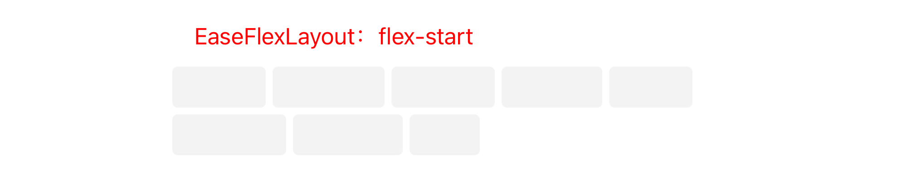
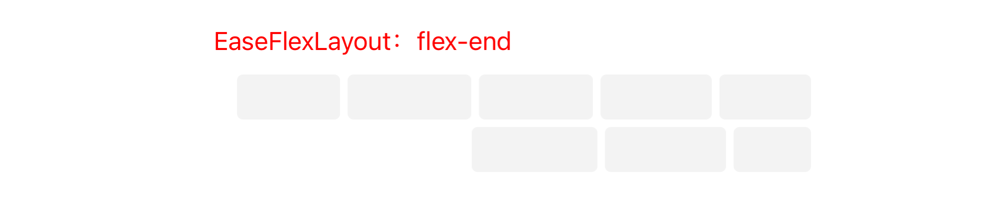
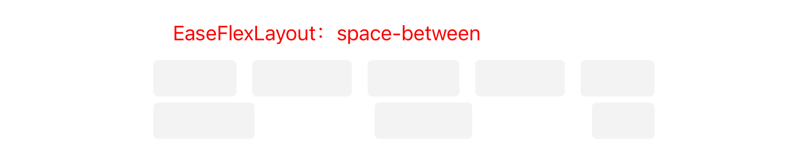
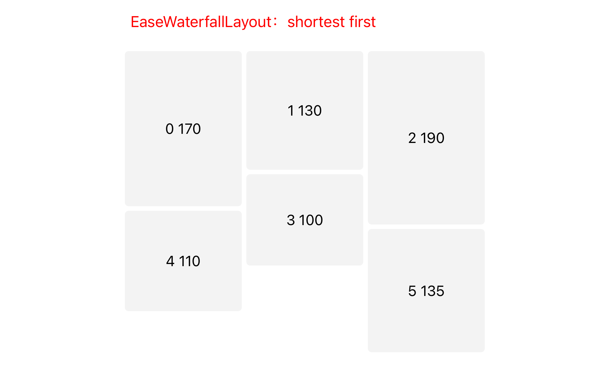
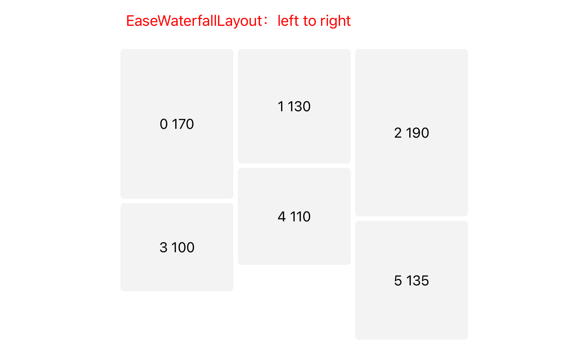
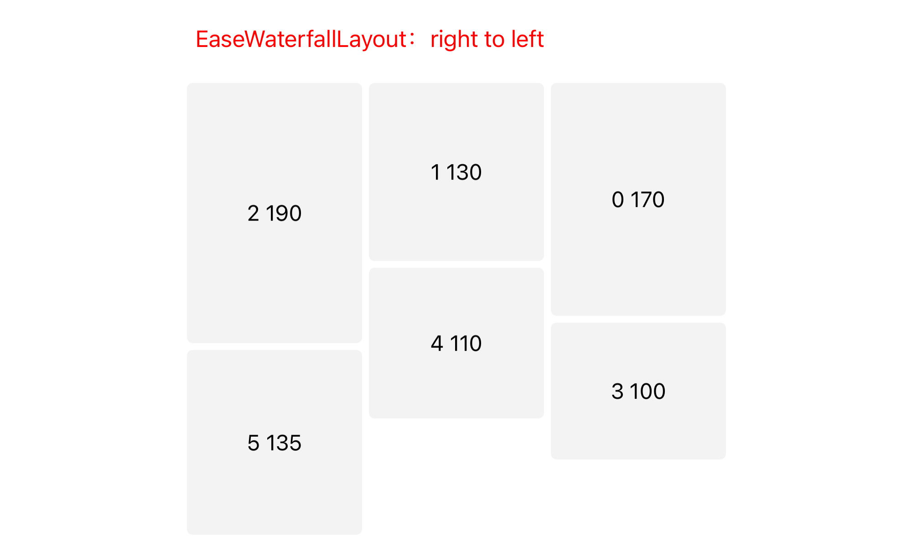

# EaseModule

[](https://travis-ci.org/Yrocky/EaseModule)
[](https://cocoapods.org/pods/EaseModule)
[](https://cocoapods.org/pods/EaseModule)
[](https://cocoapods.org/pods/EaseModule)

## Example

进入`example`文件夹，在终端执行`pod install`，然后打开对应的工程文件即可。

Demo共分为Objective-C和Swift两种类型的，前者使用样式比较丰富，后者仅仅用来实现了一个Resume效果。

## Installation

EaseModule is available through [CocoaPods](https://cocoapods.org). To install
it, simply add the following line to your Podfile:

```ruby
pod 'EaseModule'
```

由于内部是使用`YTKNetwork`来担当网络请求角色的，所以会依赖`YTKNetwork`，如果有独立的网络层，可以考虑修改源码。

## Framework

在使用之前可以参考[这篇文章](http://yrocky.github.io/2020/07/15/use-Self-Manager-make-Module/)，该文章讲述了EaseModule最初的实现架构。随着参考了更多的app，观察了更多的界面展示 ，逐渐添加了一些比较实用的功能，具体的特性下面会一一介绍。

在前面提到的文章中的架构中，要实现更多样的布局样式比较麻烦，更多的时候需要借助额外的UICollectionViewLayout，并且在多样式混用的时候性能还不是很理想。另外，随着iOS13、14这样的新版本release之后，苹果的主流UI样式也发生了很大的变化，更多的使用圆角，单元素圆角、区域圆角等等，像是为某个section设置背景颜色这种需求，在`UICollectionViewCompositionalLayout`布局出来之后实现起来就更简单了。

在这样的背景下，重新优化了项目的架构，使用一个私有的`EaseModuleFlowLayout : UICollectionViewFlowLayout`布局类来强化布局，为提供更多布局效果的核心，提供`EaseBaseLayout`及子类来完成具体的布局效果，主要是将以前`Layout`部分中的功能分离成常用的布局效果。

## Feature

* 多样、实用的布局
* 黏性header
* 无数据时候的占位效果
* 为section添加背景、阴影效果
* 设置当前section最多展示数量
* 水平布局多种分页选择

### layout

目前支持三种主流的布局样式：`list`、`flex`、`waterfall`，`grid布局`目前还在构思中，不日就会添加到项目中，目前的三种layout都支持**垂直**和**水平**两种布局样式。

#### list

> DemoListLayoutModule

常规布局效果，可以实现像是UITableView、UICollectionView这样的展示样式。

在水平布局中，如果通过 `distribution` 和 `itemRatio`计算出来的 cell高度大于 `horizontalArrangeContentHeight`，则会限制为`horizontalArrangeContentHeight`。如果小于则会按照`从上之下、从左至右`的顺序进行排列。另外，还可以设置`row`来决定 `horizontalArrangeContentHeight`，此时设置 `horizontalArrangeContentHeight`将无效。

* table-view like

    ``` Objective-C
    // in SomeComponent.m
    
    EaseListLayout * listLayout = [EaseListLayout new];
    listLayout.lineSpacing = 0.5f;
    listLayout.distribution = [EaseLayoutDimension distributionDimension:1];
    listLayout.itemRatio = [EaseLayoutDimension absoluteDimension:44.0f];
    ```

* collection-view like

    ``` Objective-C
    // in SomeComponent.m
    ...
    listLayout.distribution = [EaseLayoutDimension distributionDimension:3];
    listLayout.itemRatio = [EaseLayoutDimension fractionalDimension:0.8];
    ...
    ```

*  orthogonal scroll

    ``` Objective-C
    // in SomeComponent.m
    ...
    listLayout.arrange = EaseLayoutArrangeHorizontal;
    listLayout.inset = UIEdgeInsetsMake(10, 10, 10, 10);
    listLayout.distribution = [EaseLayoutDimension fractionalDimension:0.55];
    listLayout.itemRatio = [EaseLayoutDimension absoluteDimension:50];
    // 可以设置行数
    listLayout.row = 3;
    // 或者设置一个垂直方向的高度限制
    //listLayout.horizontalArrangeContentHeight = 150;
    ...
    ```

#### flex

> DemoFlexLayoutModule

参考前端的`Flex-layout`，提供`flex-start`、`center`、`flex-end`、`space-around`、`space-between`4种效果来布局元素，该布局的水平效果不支持多行效果，只能显示`1行`。

* flex-start

    ``` Objective-C
    // in SomeComponent.m
    
    EaseFlexLayout * flexLayout = [EaseFlexLayout new];
    flexLayout.justifyContent = EaseFlexLayoutFlexStart;
    flexLayout.inset = UIEdgeInsetsMake(0, 0, 0, 0);
    // itemHeight在水平和垂直显示效果中都需要设置
    flexLayout.itemHeight = 30;
    // 通过代理方法来返回每一个元素的显示尺寸
    flexLayout.delegate = self;
    ```
    

* center

    ``` Objective-C
    // in SomeComponent.m
    ...
    flexLayout.justifyContent = EaseFlexLayoutCenter;
    ...
    ```
    
    

* flex-end

    ``` Objective-C
    // in SomeComponent.m 
    ...
    flexLayout.justifyContent = EaseFlexLayoutFlexEnd;
    ...
    ```
    
    

* space-around

    ``` Objective-C
    // in SomeComponent.m
    ...
    flexLayout.justifyContent = EaseFlexLayoutSpaceAround;
    ...
    ```

	

* space-between

    ``` Objective-C
    // in SomeComponent.m
    ...
    flexLayout.justifyContent = EaseFlexLayoutSpaceBetween;
    ...
    ```

	
  
* orthogonal scroll

    ``` Objective-C
    // in SomeComponent.m
    ...
    flexLayout.arrange = EaseLayoutArrangeHorizontal;
    ...
    ```

    

#### waterfall

> DemoWaterfallLayoutModule

在瀑布流的垂直布局中，需要指明`column`来决定有多少列，可选的追加类型`renderDirection`有：`EaseWaterfallItemRenderShortestFirst`、`EaseWaterfallItemRenderLeftToRight`、`EaseWaterfallItemRenderRightToLeft`。

与其他布局一样，水平效果的时候需要设置`horizontalArrangeContentHeight`，另外需要设置`row`来决定可以展示多少行，水平的瀑布流效果支持的数据追加类型有：`EaseWaterfallItemRenderShortestFirst`、`EaseWaterfallItemRenderBottomToTop`、`EaseWaterfallItemRenderTopToBottom`三种。

* shortest first

    ``` Objective-C
    // in SomeComponent.m
    
    ...
    EaseWaterfallLayout * waterfallLayout = [EaseWaterfallLayout new];
    waterfallLayout.column = 3;
    waterfallLayout.renderDirection = EaseWaterfallItemRenderShortestFirst;
    waterfallLayout;
    ...
    ```

    

* left to right

    ``` Objective-C
    // in SomeComponent.m
    
    ...
    waterfallLayout.column = 3;
    waterfallLayout.renderDirection = EaseWaterfallItemRenderLeftToRight;
    ...
    ```

    
    
* right to left

    ``` Objective-C
    // in SomeComponent.m
    
    ...
    waterfallLayout.column = 3;
    waterfallLayout.renderDirection = EaseWaterfallItemRenderRightToLeft;
    ...
    ```
    
    
    
* orthogonal scroll

    ``` Objective-C
    // in SomeComponent.m
    
    ...
    waterfallLayout.row = 3;
    waterfallLayout.horizontalArrangeContentHeight = 300;
    waterfallLayout.arrange = EaseLayoutArrangeHorizontal;
    waterfallLayout.renderDirection = EaseWaterfallItemRenderBottomToTop;
    ...
    ```
    
    


### sticky header

>  DemoMusicModule

只需要为Component的`headerPin`属性设置为YES，就可以拥有一个黏性的header-view。

### placehold

> DemoLivingModule

以上3中布局效果都支持placehold功能，在没有数据的时候为Component设置`needPlacehold`以及`placeholdHeight`，然后返回对应的cell即可。

由于3中布局都支持水平方向的展示，因此`placeholdHeight`可能会和`horizontalArrangeContentHeight`有计算上的冲突，基于无数据的占位显示这样的使用场景，这个时候以`placeholdHeight`为最终的展示高度。

### decorate

> DemoBackgroundDecorateModule

使用**builder模式**来实现装饰功能，除了提供为section添加背景颜色这样的基础功能外，还增加了`图片`、`渐变`、`阴影`效果，这个主要同时设置builder的`contents`属性来完成，它是一个具体的类的实例：`EaseComponentDecorateContents`。同时还支持设置圆角`radius`，边距`inset`。

除了提供以上功能，还支持背景区域的包含范围，通过设置builder的`decorate`属性来决定，这是一个`EaseComponentDecorate`枚举，它的定义如下：

``` c
typedef NS_ENUM(NSInteger, EaseComponentDecorate) {
    /// 没有背景装饰效果
    EaseComponentDecorateNone,
    /// 只有item
    EaseComponentDecorateOnlyItem,
    /// header+item
    EaseComponentDecorateContainHeader,
    /// item+footer
    EaseComponentDecorateContainFooter,
    /// header+item+footer
    EaseComponentDecorateAll,
};
```

* 背景颜色

    ``` Objective-C
    // in someModule.m
    DemoBackgroundDecorateComponent * comp = [DemoBackgroundDecorateComponent new];
    comp.layout.inset = UIEdgeInsetsMake(100, 20, 10, 20);
    [comp addDecorateWithBuilder:^(id<EaseComponentDecorateAble>  _Nonnull builder) {
        builder.decorate = EaseComponentDecorateOnlyItem;
        builder.radius = 4.0f;
        builder.contents = ({
            EaseComponentDecorateContents * contents =
            [EaseComponentDecorateContents colorContents:[UIColor colorWithHexString:@"#8091a5"]];
            contents;
        });
    }];
    ...
    ```


* 图片

    ``` Objective-C
    // in someModule.m
    ...
    [comp addDecorateWithBuilder:^(id<EaseComponentDecorateAble>  _Nonnull builder) {
        builder.decorate = EaseComponentDecorateOnlyItem;
        builder.radius = 10.0f;
        builder.inset = UIEdgeInsetsMake(0, -10, 0, -10);
        builder.contents = ({
            EaseComponentDecorateContents * contents =
            [EaseComponentDecorateContents imageContents:[UIImage imageNamed:@"forbid"]];
            contents;
        });
    }];
    ...
    ```

* 渐变

    ``` Objective-C
    ...
    [comp addDecorateWithBuilder:^(id<EaseComponentDecorateAble>  _Nonnull builder) {
        builder.decorate = EaseComponentDecorateOnlyItem;
        builder.radius = 4.0f;
        builder.inset = UIEdgeInsetsMake(0, -10, 0, -10);
        builder.contents = ({
            EaseComponentDecorateContents * contents =
            [EaseComponentDecorateContents gradientContents:^(id<EaseComponentDecorateGradientContentsAble>  _Nonnull contents) {
                contents.startPoint = CGPointMake(0.5, 0);
                contents.endPoint = CGPointMake(0.5, 1);
                contents.colors = @[
                    [UIColor colorWithHexString:@"#FF9E5C"],
                    [UIColor colorWithHexString:@"#FF659F"]
                ];
                contents.locations = @[@(0), @(1.0f)];
            }];
            contents;
        });
    }];
    ```

* 阴影

    ``` Objective-C
    ...
    [comp addDecorateWithBuilder:^(id<EaseComponentDecorateAble>  _Nonnull builder) {
        builder.decorate = EaseComponentDecorateOnlyItem;
        builder.radius = 4.0f;
        builder.inset = UIEdgeInsetsMake(0, -10, 0, -10);
        [builder setContents:({
            EaseComponentDecorateContents * contents =
            [EaseComponentDecorateContents colorContents:[UIColor whiteColor]];
            contents.shadowColor = [UIColor redColor];
            contents.shadowOffset = CGSizeMake(0, 0);
            contents.shadowOpacity = 0.5;
            contents.shadowRadius = 3;
            contents;
        })];
    }];
    ```

### maxDisplay

> DemoSearchModule

最大展示功能在不同的布局中有不同的体现。

比如由于计算的原因，`EaseWaterfallLayout`中只能限制最大展示个数：`maxDisplayCount`。

而在`EaseFlexLayout`中，垂直布局可以分别设置最大显示行数：`maxDisplayLines`以及最大显示个数：`maxDisplayCount`，但是在水平布局中只能设置`maxDisplayCount`。

对于`EaseListLayout`来说，在垂直展示的时候，同时支持`maxDisplayLines`和`maxDisplayCount`，但是在水平布局的时候由于行数可以根据`row`来决定，所以仅支持`maxDisplayCount`。

> 对于既支持`maxDisplayCount`又支持`maxDisplayLines`的layout来说，如果同时设置了这两个属性，最后的计算结果将以`maxDisplayLines`为准，考虑到实际业务情况中并不会这么做，并且这么做也没有意义，但这里还是提前做了准则约束。

### scrolling behavior

仅仅在水平展示效果的时候有用，

## Author

Yrocky, 983272765@qq.com

## Thanks

* [IGListKit](https://github.com/Instagram/IGListKit)
* [IBPCollectionViewCompositionalLayout](https://github.com/kishikawakatsumi/IBPCollectionViewCompositionalLayout)
* [CHTCollectionViewWaterfallLayout](https://github.com/chiahsien/CHTCollectionViewWaterfallLayout)

## License

EaseModule is available under the MIT license. See the LICENSE file for more info.
